# VSD-SOC-DESIGN-PROGRAM

## Description
Transforming bare RTL netlist to final tapeout

## Features
- Open Source Toolchain for RTL2GDS
- ASIC DESIGN FLOW

## Session 1: Open Source Tools
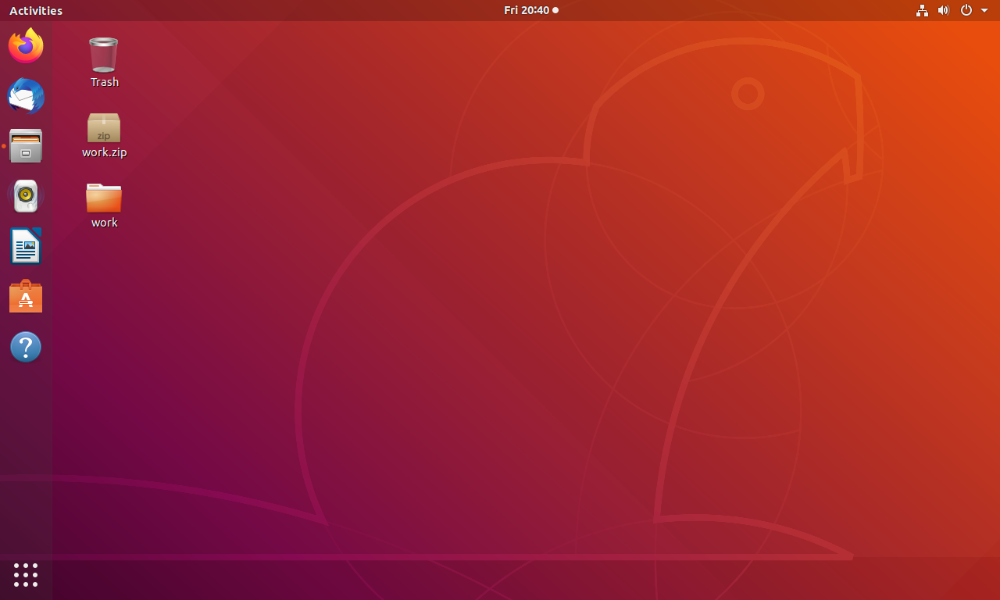

Open a shell inside the directory  ~/Desktop/work/tools/openlane_working_dir/openlane
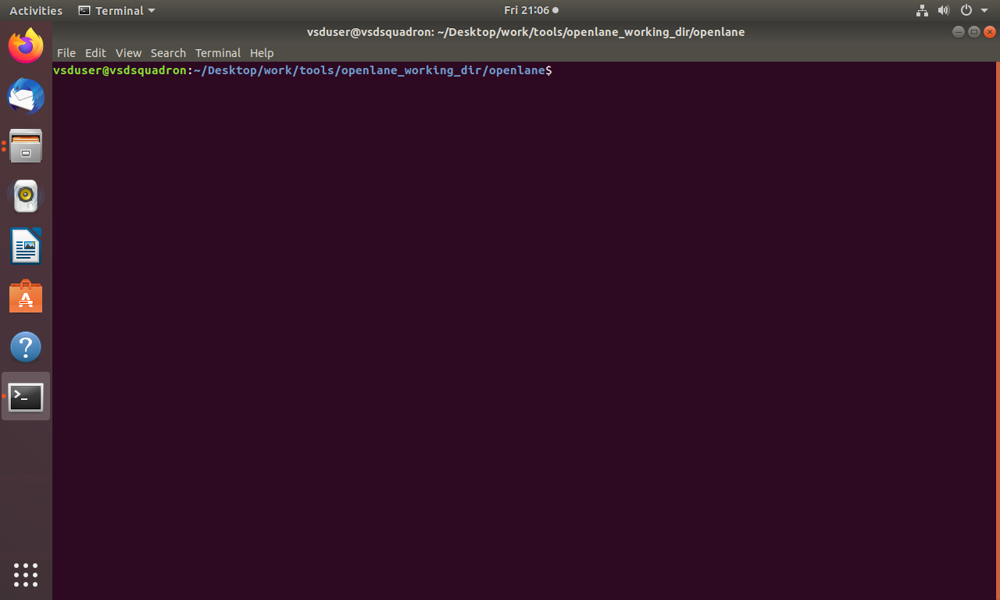

Run these commands
```bash
# Example of a command to install the project
docker
bash-4.2$ ./flow.tcl -interactive
% package require openlane
% prep -design picorv32a
% run_synthesis
```

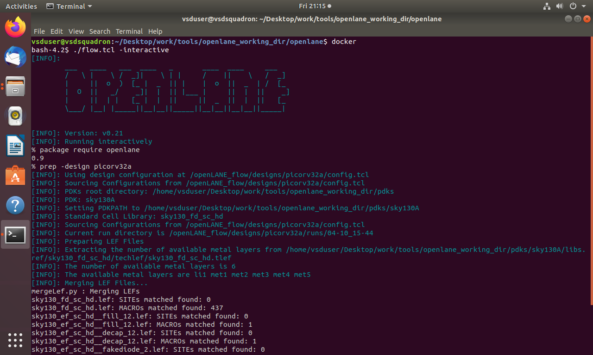
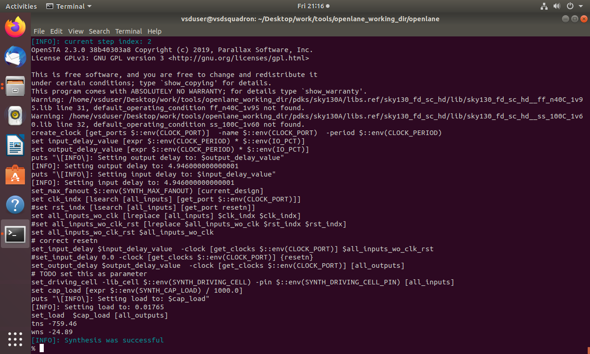


flop ratio =(total no. of d flop realised) / (total no. cells)
           = 1613/14876
           = 0.10842


## Session 2: Good vs Bad Floorplanning

Run floorplan
```bash
% run_floorplan
```
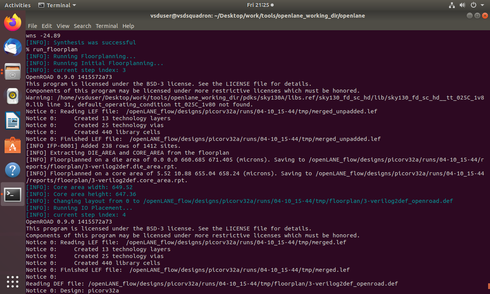
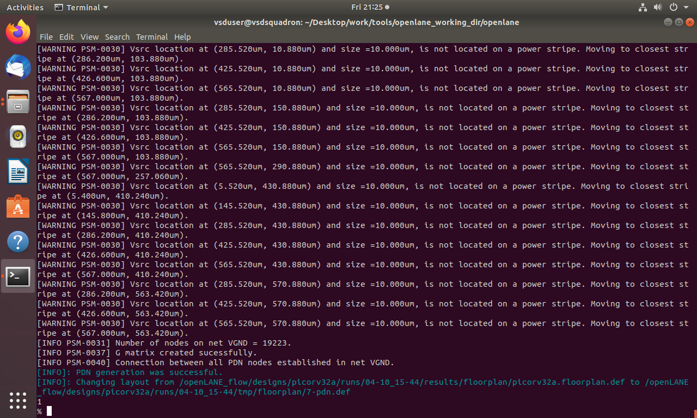


### Change directory to path containing generated floorplan def
```bash
cd ~/Desktop/work/tools/openlane_working_dir/openlane/designs/picorv32a/runs/04-10_15-44/tmp/floorplan
```
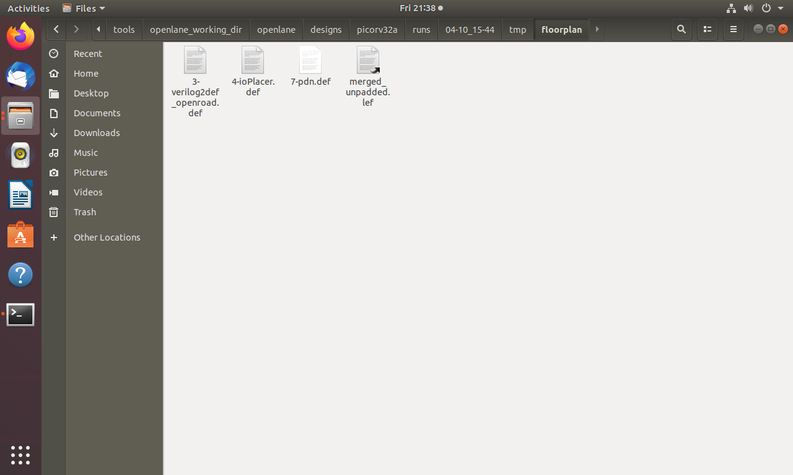
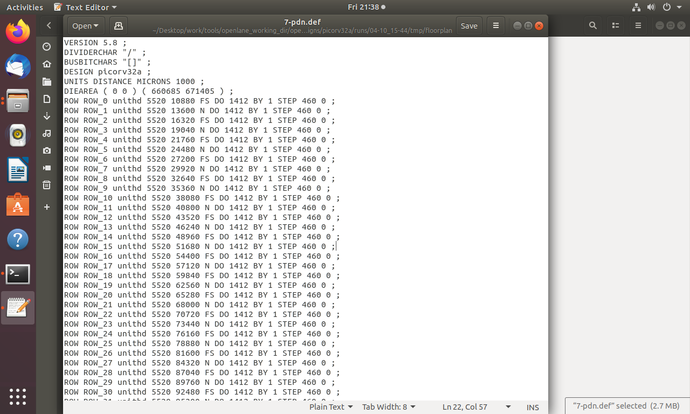

### Calculate the Die area of the floorplan
```markdown
Die width= 660.685 microns
Die height= 671.405 microns 
Die Area = Die width *Die height = 660.685 * 671.405 = 443587.212 Square microns
```

### Command to load the floorplan def in magic tool
```bash
magic -T /home/vsduser/Desktop/work/tools/openlane_working_dir/pdks/sky130A/libs.tech/magic/sky130A.tech lef read ../../tmp/merged.lef def read picorv32a.floorplan.def &
```
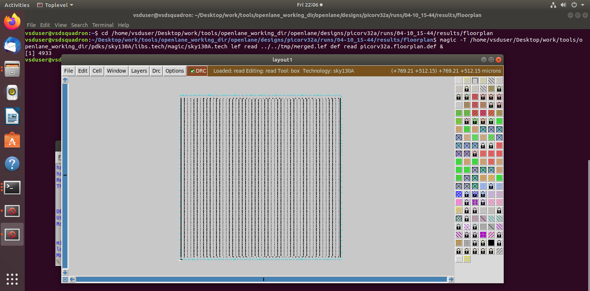

### Command to run placement
```bash
% placement
```
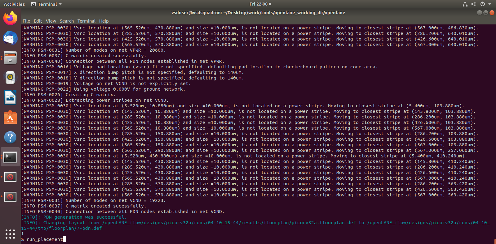
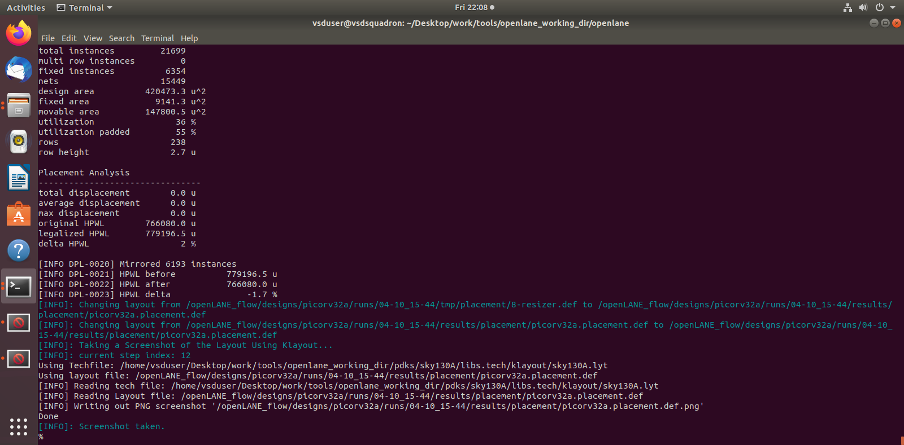

### Command to load the placement def in magic tool
```bash
# Change directory to path containing generated placement def
cd Desktop/work/tools/openlane_working_dir/openlane/designs/picorv32a/runs/17-03_12-06/results/placement/

# Command to load the placement def in magic tool
magic -T /home/vsduser/Desktop/work/tools/openlane_working_dir/pdks/sky130A/libs.tech/magic/sky130A.tech lef read ../../tmp/merged.lef def read picorv32a.placement.def &
```
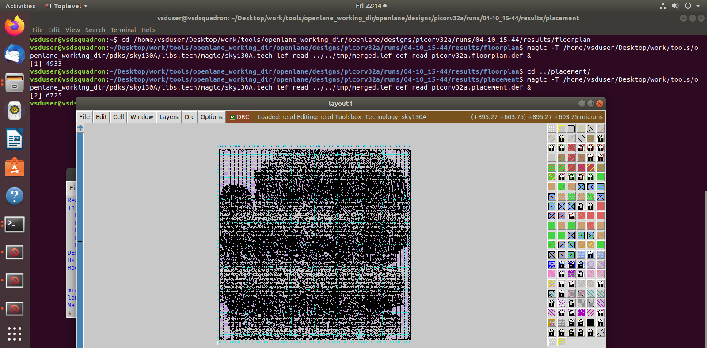


## Session 3: Designing Library Cell

### Clone custom inverter standard cell design from github repository
```bash
# Change directory to openlane
cd Desktop/work/tools/openlane_working_dir/openlane

# Clone the repository with custom inverter design
git clone https://github.com/nickson-jose/vsdstdcelldesign

# Change into repository directory
cd vsdstdcelldesign

# Copy magic tech file to the repo directory for easy access
cp /home/vsduser/Desktop/work/tools/openlane_working_dir/pdks/sky130A/libs.tech/magic/sky130A.tech .

# Check contents whether everything is present
ls

# Command to open custom inverter layout in magic
magic -T sky130A.tech sky130_inv.mag &
```
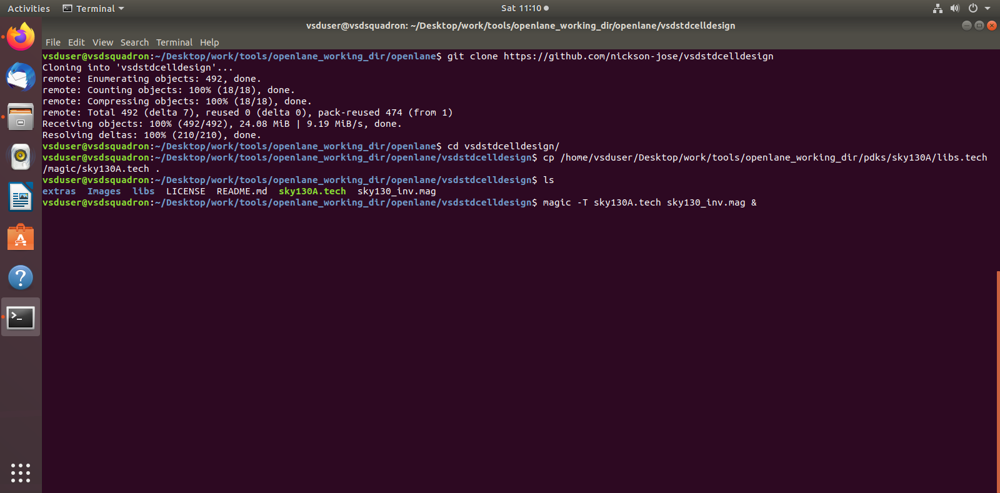
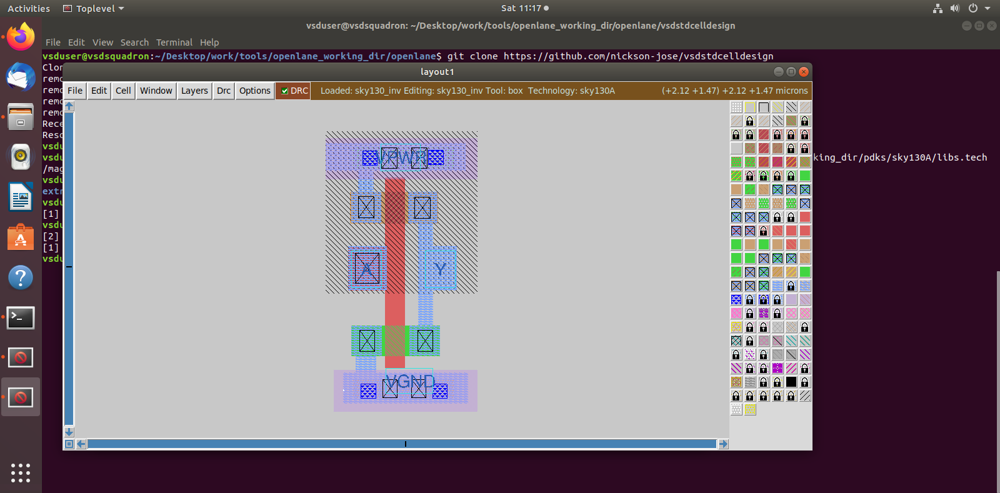

###  Spice extraction of inverter in magic.
```bash
# Check current directory
pwd

# Extraction command to extract to .ext format
extract all

# Before converting ext to spice this command enable the parasitic extraction also
ext2spice cthresh 0 rthresh 0

# Converting to ext to spice
ext2spice
```

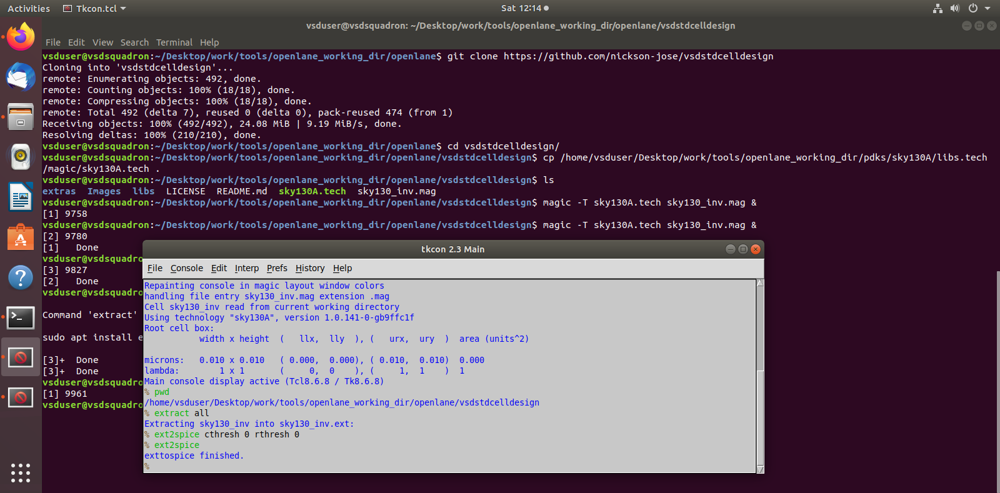

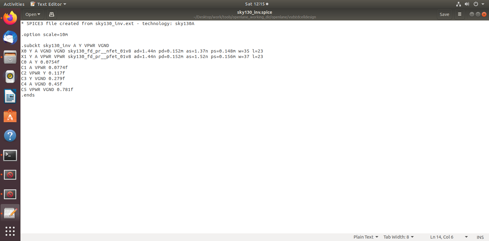

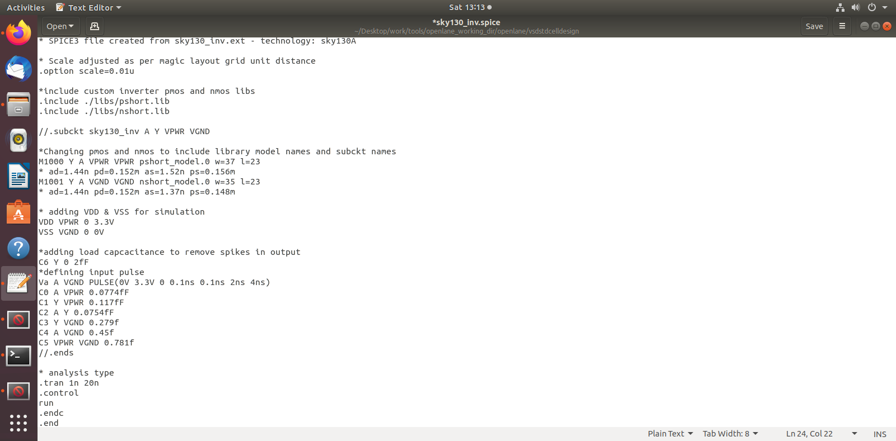

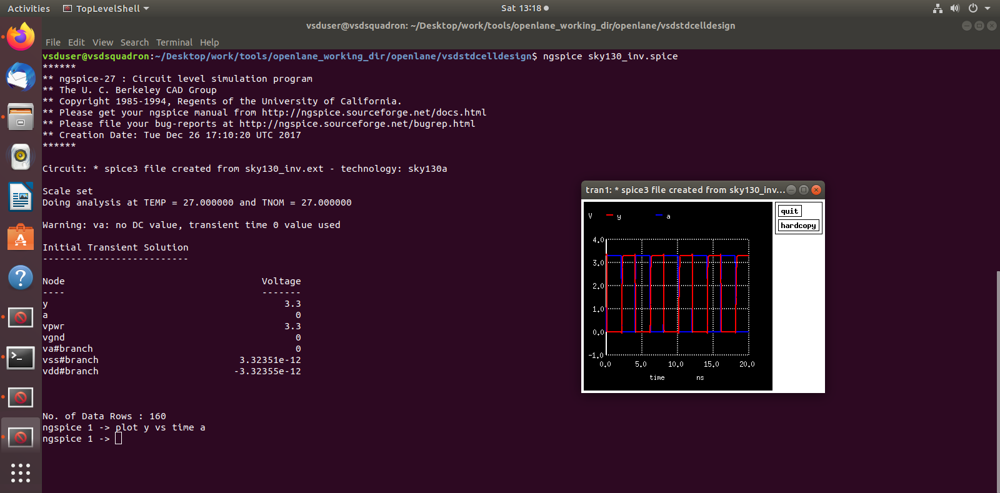


## Session 4: Pre-Layout timing analysis
## Session 5: RTL2GDS using TritonROUTE and OpenSTA


